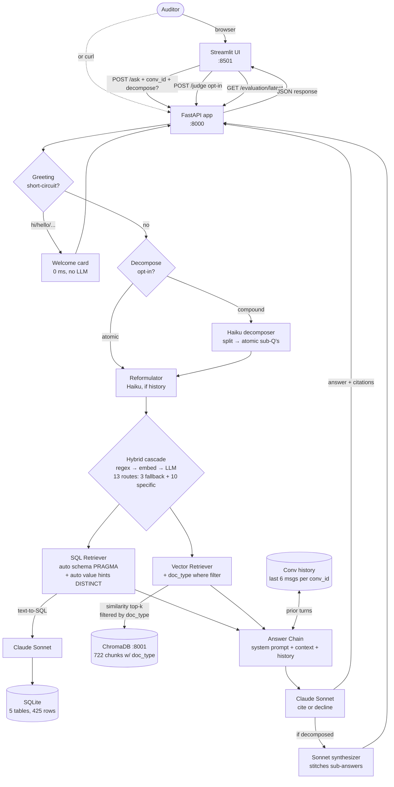

# CLAUDE.md

Guidance for Claude Code (claude.ai/code) when working in this repository.

---

## What this repo is

A local AI audit assistant for **Northstar Robotics Inc. (Q1 2026)**. It answers natural-language questions over both structured audit data (transactions, journal entries, vendors, trial balance) and unstructured documents (auditing standards, policies, workpapers, contracts) — with citations, guardrails, and a measurable eval harness.

The system is RAG with planning where it earns its keep: opt-in question decomposition for compound queries, Haiku-powered reformulation for multi-turn coreference, a 13-route routing dictionary with structural retrieval scoping via `doc_type` chunk metadata.

---

## Architecture



Three services brought up by one `docker compose up`:

- `audit-ui` (Streamlit, port 8501) — chat + live metrics + eval suite viewer
- `audit-app` (FastAPI, port 8000) — `/ask`, `/judge`, `/evaluation/latest`, `/health`, `DELETE /conversations/{id}`
- `audit-chromadb` (Chroma, port 8001) — vector store with persistent volume

In-process inside `audit-app`: SQLite file, HuggingFace embeddings (`all-MiniLM-L6-v2`), conversation history dict keyed by `conversation_id`.

---

## Commands

Everything runs through Docker Compose. The `Makefile` wraps the common ones.

```bash
# Build images (one-time, or after dependency changes)
make build

# Start ChromaDB + app + UI (ingestion auto-runs at startup)
make up                          # foreground
make up-d                        # detached

# Ask a question
make ask Q="Which transactions are missing support?"

# Or hit the API directly
curl -X POST http://localhost:8000/ask \
  -H "Content-Type: application/json" \
  -d '{"question": "What is the total travel expense for Q1 2026?"}'

# Run the 22-case evaluation suite (app must already be up)
make evaluate

# Tail app logs (structured JSON per request)
make logs

# Stop everything
make down                        # keep volumes (faster restart)
make clean                       # wipe volumes (forces full re-ingestion)
```

**Endpoints:**

- `POST /ask` — `{question, conversation_id?, router_mode?, decompose?, include_context?}` → `{answer, citations, query_type, routing_reason, conversation_id, turn_index, decomposition?, sub_results?, latency_ms, ...}`. Pass the same `conversation_id` across turns for multi-turn memory; omit for single-turn.
- `POST /judge` — `{question, answer, context, metrics: [...]}` → `{faithfulness, answer_relevance, refusal_correct}`. LLM-as-judge via Haiku, opt-in from the UI.
- `GET /evaluation/latest` — returns the most recent `eval_results.json` from disk (bind-mounted so it survives container rebuilds).
- `DELETE /conversations/{conversation_id}` — wipe the in-process history for that conversation.
- `GET /health` — liveness probe.
- `GET /` — redirects to `/docs` (Swagger UI).

**Required env:** `ANTHROPIC_API_KEY` in `.env` (copy from `.env.example`).

---

## Dataset — Northstar Robotics Inc. (Q1 2026)

Extracted to `data/northstar_robotics_audit_dataset/`.

**Structured files** (loaded into SQLite at startup):

| File | Rows | Table name | Key columns |
|------|------|------------|-------------|
| `financial_transactions.csv` | 177 | `transactions` | transaction_id, date, account_number, account_name, amount_usd, vendor_id, support_status, audit_issue_flag |
| `journal_entries.csv` | 44 | `journal_entries` | journal_entry_id, account_number, debit_usd, credit_usd, entry_type, audit_issue_flag |
| `audit_support_mapping.csv` | 177 | `support_mapping` | transaction_id, document_id, evidence_type, support_status |
| `vendor_master.json` | 10 | `vendors` | vendor_id, name, category, status, risk, metadata_complete |
| `trial_balance.xlsx` | 17 | `trial_balance` | account-level balances |

**Unstructured files** (chunked + embedded into ChromaDB, each chunk tagged with `doc_type`):

| File | doc_type |
|---|---|
| `IAASB-2023-2024-Handbook-Volume-2.pdf` (134 pages) | `standard` |
| `revenue_recognition_policy.pdf` | `policy` |
| `Retail-Lease-Agreement-Acme.pdf` | `contract` |
| `audit_planning_memo.docx` | `memo` |
| `audit_procedures_revenue_and_expenses.docx` | `procedure` |
| `client_provided_evidence_notes.txt` | `evidence` |
| `travel_expense_workpaper.md` | `workpaper` |

**Pre-seeded audit issues in the data** (useful for demo questions):

- TX1012, TX1033 — missing executed contracts
- TX1018 — multiple performance obligations (hardware + Fleet AI subscription)
- TX1039 — acceptance certificate dated after quarter-end
- TX1990 — duplicate support package
- V1007, V1009 — incomplete vendor onboarding; V1010 — inactive pending review

---

## Key features and where they live

| Feature | File(s) |
|---|---|
| **3-strategy router cascade** (regex → embedding → LLM) | `app/retrieval/router.py`, `router_regex.py`, `router_embedding.py`, `router_llm.py` |
| **Richer routing dictionary** (13 routes with scope metadata) | `app/retrieval/routes.py`, `app/retrieval/__init__.py` |
| **Question reformulator** (Haiku rewrites follow-ups as standalone) | `app/retrieval/reformulator.py` |
| **Question decomposer** (opt-in compound-question splitting) | `app/retrieval/decomposer.py` |
| **Greeting short-circuit** (deterministic, 0 ms) | `app/chain.py` |
| **Auto-discovered SQL value hints + 0-row context shaping** | `app/ingestion/structured.py::get_value_hints`, `app/retrieval/sql_retriever.py` |
| **`doc_type` chunk metadata** (powers IAASB-dominates fix structurally) | `app/ingestion/unstructured.py`, `app/retrieval/vector_retriever.py` |
| **Multi-turn memory** (in-process per-conversation deque) | `app/chain.py::_history` |
| **22-case eval harness** (4 deterministic + 3 LLM-judged metrics) | `scripts/evaluate.py`, `app/evaluation/metrics.py`, `app/evaluation/judge.py` |
| **JSON observability log** (per-request structured line on stdout) | `app/observability.py` |
| **Live metrics + offline eval suite in the UI** | `ui/streamlit_app.py` |

---

## Tech stack

- **Python 3.11 + FastAPI** — language and API
- **LangChain 0.2** — document loaders, recursive splitter, Chroma integration
- **ChromaDB 0.5.3** — vector store, official Docker image
- **`all-MiniLM-L6-v2`** — local embeddings, 80 MB, runs on CPU, baked into image at build
- **Claude Sonnet 4.5** — answers, text-to-SQL, synthesizer
- **Claude Haiku 4.5** — LLM-as-judge, reformulator, decomposer, LLM router
- **SQLite** — structured warehouse, 425 rows
- **Streamlit 1.36** — interactive demo UI
- **Docker Compose** — packaging

**Dependency pins worth knowing about:**

- `chromadb==0.5.3` — `langchain-chroma 0.1.3` explicitly excludes 0.5.4 and 0.5.5
- `httpx<0.28` — `anthropic 0.34` is built against the deprecated `proxies=` kwarg
- `posthog<3` — `chromadb 0.5.3` calls `posthog.capture()` positionally; posthog 3+ requires keyword-only args

---

## Routing dictionary — 13 routes

3 fallback families + 10 specific categories. Each specific route carries retrieval scope (`is_structured`, `is_unstructured`, `vector_filter`, `sql_table_hint`) defined in `app/retrieval/routes.py`.

| Family | Specific routes | Vector filter |
|---|---|---|
| `structured` (fallback) | `transaction_query`, `journal_entry_query`, `vendor_lookup`, `balance_query` | none (SQL only) |
| `unstructured` (fallback) | `policy_lookup`, `standards_lookup`, `procedure_lookup`, `evidence_lookup` | `doc_type` filter per category |
| `hybrid` (fallback) | `hybrid_tx_evidence`, `hybrid_tx_compliance` | multi-doc-type `where` clause |

The regex router emits specific categories for clear doc-type signals; embedding router emits the 3 fallback families; LLM router can emit any of the 13. Compare mode votes on the route FAMILY (so regex's `transaction_query` and embedding's `structured` count as the same vote — both want SQL).

---

## Evaluation

22 hand-curated cases (16 in-scope + 4 OOS + 2 in-domain-but-no-data) in `scripts/evaluate.py`. Seven metrics.

**Deterministic** (`app/evaluation/metrics.py`):
- `citation_accuracy` — fraction of cited entities that appear in retrieved context
- `context_precision` — overlap / retrieved
- `context_recall` — overlap / expected
- `entity_coverage` — fraction of expected entity IDs surfaced in answer

**LLM-as-judge** (`app/evaluation/judge.py`, Haiku, ~$0.005 each):
- `faithfulness` — claims supported by context
- `answer_relevance` — answer addresses the question
- `refusal_correct` — OOS handling + no-data fabrication guard

Latest aggregate: ctx precision 81%, ctx recall 88.5%, faithfulness 89.5%, entity coverage 88.9%, refusal rate 83.3%, citation accuracy 86.6%, answer relevance 87.2%. Avg latency ~10s. Full per-case results in `eval_results.json` (bind-mounted to host).

---

## Guardrails

- **SELECT-only SQL execution** — text-to-SQL refuses any non-SELECT statement before execution
- **Cite-or-decline system prompt** — six rules in `app/chain.py::SYSTEM_PROMPT`
- **Absolute OOS refusal** — no partial answers, no "by the way" engagement with off-topic prompts
- **Prompt-injection treated as OOS** — "ignore your instructions" gets the same refusal as a weather question
- **Input cap 2000 chars** — Pydantic-level bound on the question field
- **Auto value hints + 0-row context** — turns cite-or-decline into a property of retrieved context, not just a policy the model is asked to follow
- **Greeting short-circuit** — deterministic bypass of router/retrieval for "hi/hello/etc."

---

## Future improvements (verbal roadmap, not built)

In rough priority order. None of these are blocking deliverables; each is a real next-step.

- SQL self-correction loop (LangGraph state machine for retry on errors)
- Needs-retrieval classifier (skip router+retrieval for pure conversational follow-ups)
- Three-layer caching ladder: Anthropic prompt caching · Redis Q→A · embedding cache · hot-chunk LRU
- Streaming responses (SSE for first-token in ~1s)
- Multi-tenancy: `tenant_id` + `engagement_id` on every row + chunk; Postgres Row-Level Security; cross-tenant adversarial eval cases
- Multi-provider LLM abstraction (`LLMProvider` Protocol, swap Anthropic ↔ Bedrock ↔ OpenAI)
- Refactor to classes for DI + testability (today's module-level singletons would become injected dependencies)
- Incremental ingestion (hash-based diff, ingest only new/changed files)
- Planner with dependent sub-task DAG (extends decomposer for multi-hop reasoning)
- MMR composing with `doc_type` filter (belt + suspenders)
- Reranker after retrieval (Cohere Rerank or bge-reranker)
- SME-validated gold set (500+ cases labeled by audit professionals)
- CI gate on eval (PR-blocking thresholds) + scheduled regression dashboards

---

## Project layout

```
app/
├── api/                  FastAPI routes + Pydantic schemas
├── chain.py              Top-level orchestration: greeting → decompose → reformulate → route → retrieve → answer
├── config.py             Pydantic Settings
├── evaluation/           Metrics + Haiku-as-judge
├── ingestion/            Structured + unstructured loaders (auto schema + auto value hints)
├── main.py               FastAPI app, lifespan ingestion
├── observability.py      Per-request JSON log line
└── retrieval/
    ├── routes.py         13-route registry with retrieval scope
    ├── router.py         Orchestrator (regex → embedding → LLM cascade, compare mode)
    ├── router_regex.py   Regex patterns (emits specific routes for obvious cases)
    ├── router_embedding.py  MiniLM cosine similarity vs intent prototypes
    ├── router_llm.py     Haiku zero-shot router with full 13-route catalog
    ├── reformulator.py   Haiku rewrites follow-ups as standalone
    ├── decomposer.py     Haiku splits compound questions; Sonnet synthesizes sub-answers
    ├── sql_retriever.py  Text-to-SQL with SELECT-only guard, auto value hints, 0-row shaping
    └── vector_retriever.py  ChromaDB similarity search with optional doc_type where filter

ui/
└── streamlit_app.py      Chat + live metrics + offline eval suite viewer

scripts/
└── evaluate.py           22-case eval suite (16 in-scope + 4 OOS + 2 no-data)

data/
└── northstar_robotics_audit_dataset/   Source files (CSV/JSON/XLSX/PDF/DOCX/TXT/MD)
```
