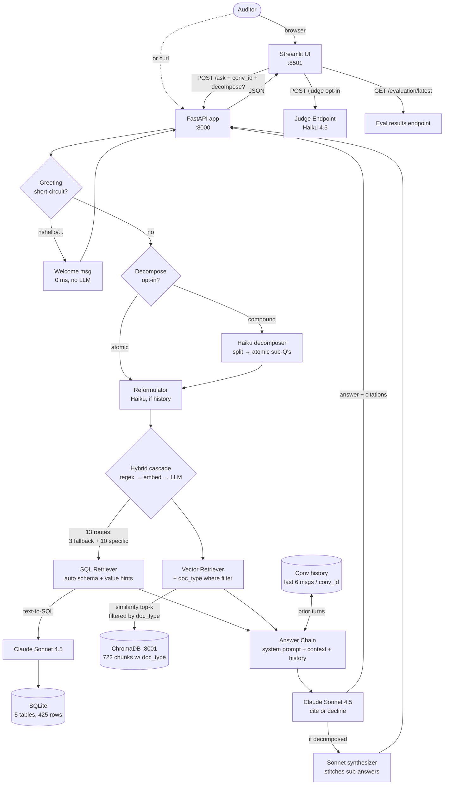
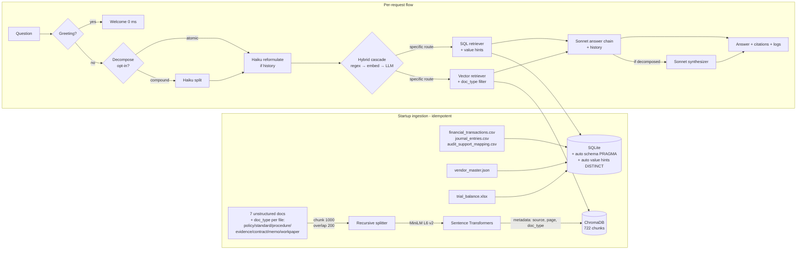

# Audit AI Assistant — Northstar Robotics Q1 2026

A local AI assistant that answers natural-language questions over Q1 2026 audit data for a fictional company (Northstar Robotics). It handles both the structured side (financial transactions, journal entries, vendors, trial balance) and the unstructured side (auditing standards, policies, lease agreement, workpapers). Every answer comes back with inline citations so an auditor can verify before trusting.

---

## Quickstart

Two minutes if Docker is already installed. You need a Docker daemon, Docker Compose, an Anthropic API key with at least ~$5 of credit, and the **dataset placed at the expected path** (see [Dataset setup](#dataset-setup) below).

```bash
# 1. Drop your key into .env
echo "ANTHROPIC_API_KEY=sk-ant-api03-..." > .env

# 2. Place the dataset at data/northstar_robotics_audit_dataset/ (see "Dataset setup" below)

# 3. Build images (one-time, ~5 min: installs deps + pre-bakes embedding model)
make build

# 4. Start everything (ChromaDB + FastAPI + Streamlit UI)
make up

# 5. Ask a question (CLI)
make ask Q="Which transactions are missing support documentation?"

# 6. Or open the UI in your browser
open http://localhost:8501           # Streamlit
open http://localhost:8000/docs      # interactive Swagger UI for the API

# 7. Run the 22-case evaluation suite
make evaluate
```

That's it. Ingestion runs automatically on first startup (~70s) and is idempotent — restarts are instant.

---

## Dataset setup

The dataset is **NOT included in this repository** — it lives in a separate source for two reasons:

1. **Copyright** — the `IAASB-2023-2024-Handbook-Volume-2.pdf` is copyrighted by IFAC; redistribution requires permission. Download free from https://www.ifac.org for personal use.
2. **Proprietary test material** — the Northstar Robotics audit data is fictional but proprietary; not shipped here to avoid leaking.

### Required directory layout

Place all twelve files under `data/northstar_robotics_audit_dataset/` at the project root:

```
data/
└── northstar_robotics_audit_dataset/
    ├── financial_transactions.csv             # 177 rows — structured ledger
    ├── journal_entries.csv                    # 44 rows — debit/credit entries
    ├── audit_support_mapping.csv              # 177 rows — TX ↔ supporting document
    ├── vendor_master.json                     # 10 vendors with metadata
    ├── trial_balance.xlsx                     # account-level balances
    ├── revenue_recognition_policy.pdf         # company policy
    ├── audit_planning_memo.docx               # planning memo
    ├── audit_procedures_revenue_and_expenses.docx   # procedure doc
    ├── client_provided_evidence_notes.txt     # evidence notes
    ├── travel_expense_workpaper.md            # workpaper
    ├── Retail-Lease-Agreement-Acme.pdf        # lease contract
    └── IAASB-2023-2024-Handbook-Volume-2.pdf  # IAASB standards (134 pages, ~2.6 MB)
```

The path is bind-mounted read-only into the `audit-app` container at `/app/data`. Once the files are in place, `make up` will pick them up automatically.

### File summary

| File | Where it goes | What it powers |
|---|---|---|
| 5 structured files (.csv / .json / .xlsx) | SQLite → 5 tables (425 rows total) | SQL retrieval for transactions, journal entries, vendors, support mapping, trial balance |
| 7 unstructured files (PDF / DOCX / TXT / MD) | ChromaDB → 722 chunks tagged with `doc_type` | Vector retrieval for policies, standards, procedures, evidence, contracts |

---

## What it does

Auditors juggle two very different kinds of data — the structured ledger and a stack of standards, policies, and workpapers. This assistant takes a plain-English question, decides which side to look on (or both), retrieves the relevant evidence, and writes an answer that cites where every claim came from.

A few specifics:

- Grounded in retrieved context only — the system prompt forbids fabrication and the answer chain refuses if context is insufficient
- Citations are structured: transaction IDs for SQL hits, file + page for document hits, the SQL query itself for aggregations
- Routes via a 13-category dictionary (10 specific routes + 3 fallback families). Three router strategies cooperate in a hybrid cascade: regex (free, ~10ms, now picks specific routes for clear cases like `policy_lookup`) → embedding similarity (free, ~50ms, falls back to broad labels) → Haiku LLM (~$0.0005, ~600ms, picks any specific route). Each specific route carries a Chroma `where` filter on `doc_type` metadata, so policy questions never compete against the 134-page IAASB handbook — the IAASB-dominates problem is solved structurally, not statistically
- Refuses out-of-scope questions without leaking partial answers — no "math is off-topic, but 247 × 13 = 3,211"

All seven example questions from the test brief are handled:

| # | Example question | Path |
|---|---|---|
| 1 | "What documentation supports this transaction?" | structured (`support_mapping` table) |
| 2 | "Are there duplicate or potentially duplicate transactions?" | structured + evidence notes |
| 3 | "Summarize the audit guidance related to revenue recognition." | unstructured (RAG) |
| 4 | "Are there transactions missing supporting documentation?" | structured |
| 5 | "What audit procedures are relevant for this area?" | unstructured (RAG) |
| 6 | "Summarize the audit standard related to revenue recognition." | unstructured (IAASB) |
| 7 | "What is the total travel expense in Q1?" | structured (text-to-SQL with SUM) |

---

## Architecture



**Three containers** brought up by a single `docker compose up`:

| Service | Image | Port | Role |
|---|---|---|---|
| `audit-ui` | local Streamlit | 8501 | Interactive chat + live-metrics demo |
| `audit-app` | local FastAPI | 8000 | RAG endpoints, judge endpoint, request logger |
| `audit-chromadb` | `chromadb/chroma:0.5.3` | 8001 | Vector store (persistent volume) |

---

## Data Flow



---

## Data Modeling

| Source file | SQLite table | Why this shape |
|---|---|---|
| `financial_transactions.csv` (177 rows) | `transactions` | 1:1 with CSV — auditors think in transactions; flattening or denormalising would lose the audit trail |
| `journal_entries.csv` (44 rows) | `journal_entries` | 1:1 — preserves the debit/credit pairing the user already understands |
| `audit_support_mapping.csv` (177 rows) | `support_mapping` | Many-to-many between TX and evidence docs — keep separate to allow precise "which doc supports TX X" queries |
| `vendor_master.json` | `vendors` | Flattened the JSON envelope (`{company, period, vendors:[…]}`) into just the inner array |
| `trial_balance.xlsx` | `trial_balance` | Column names normalised to `snake_case` for SQL friendliness |

The 7 unstructured documents (PDFs, DOCX, TXT, MD) are loaded with LangChain's per-format loaders, chunked at 1000 chars with 200-char overlap, embedded locally with `all-MiniLM-L6-v2`, and stored in a single ChromaDB collection (`audit_documents`). Each chunk carries `{source, page}` metadata so citations can point to file + page.

**Choices justified:**
- **SQLite** over Postgres — single-file, zero ops, exactly right for ≤ 1k rows and one user
- **ChromaDB** as a separate container — official usage pattern, isolates the vector store, matches a typical OpenSearch Serverless-style deployment shape
- **`all-MiniLM-L6-v2`** for embeddings — 80MB, runs on CPU, no extra API dependency, baked into the Docker image at build time so startup is instant
- **Chunk size 1000 / overlap 200** — small enough to keep top-5 retrieval focused, large enough to preserve paragraph context
- **Data-driven SQL prompt** — schema introspected via `PRAGMA table_info` AND value hints auto-discovered via `SELECT DISTINCT` on bounded-cardinality columns (quarters, accounts, statuses) at query time. The model always sees the EXACT literals currently in the data — no hand-curated value reference to drift out of sync. When a new quarter or account is loaded, the prompt updates next request, zero code change.
- **Explicit 0-row context** — when SQL returns no rows, the context shape changes to "no records match — decline honestly, do not extrapolate." Prevents the model from inventing numbers when asked for data that doesn't exist (e.g. Q3-2026, account 9999). Verified with 2 dedicated eval cases — 0 fabrications.

---

## Endpoints

| Method | Path | Purpose |
|---|---|---|
| `GET` | `/` | Redirects to `/docs` (Swagger UI) |
| `GET` | `/health` | Liveness probe |
| `POST` | `/ask` | Ask a question. Returns `{answer, citations, query_type, routing_reason, conversation_id?, turn_index?, latency_ms, tokens, retrieved_sources, sql?, chunks?}`. Pass `conversation_id` to enable multi-turn memory; omit for single-turn. |
| `POST` | `/judge` | Run LLM-as-judge metrics (faithfulness, answer_relevance, refusal_correct) against a given answer. Uses Haiku. |
| `DELETE` | `/conversations/{conversation_id}` | Drop in-memory history for that conversation. |

Single-turn:
```bash
curl -X POST http://localhost:8000/ask \
  -H "Content-Type: application/json" \
  -d '{"question":"Which transactions are missing support?"}'
```

Multi-turn — pass the same `conversation_id` across calls:
```bash
curl -X POST http://localhost:8000/ask -H "Content-Type: application/json" \
  -d '{"question":"Which transactions are missing support?","conversation_id":"my-session-42"}'

curl -X POST http://localhost:8000/ask -H "Content-Type: application/json" \
  -d '{"question":"What files supported that answer?","conversation_id":"my-session-42"}'

curl -X DELETE http://localhost:8000/conversations/my-session-42
```

History is bounded at the last 6 messages (3 user/assistant pairs) and lives in-process. The Streamlit UI assigns one `conversation_id` per browser session and exposes a "🆕 New conversation" button that calls the DELETE endpoint and rotates the id.

---

## Guardrails and Safety

Decisions made deliberately:

| Guardrail | Where it lives | Why |
|---|---|---|
| **SELECT-only SQL** | `app/retrieval/sql_retriever.py` refuses anything that isn't `SELECT` | Prevents the LLM from issuing DDL/DML through the text-to-SQL path |
| **Cite-or-decline system prompt** | `app/chain.py` system prompt | Forces the model to ground every claim in retrieved context; if context is insufficient it must say so |
| **Absolute out-of-scope refusal** | `app/chain.py` rule #4 | Refuses without leaking even partial answers (no "math is off-topic, but 247 × 13 = 3,211") |
| **Prompt-injection treatment** | `app/chain.py` rule #5 | Treats "ignore your previous instructions" patterns as OOS |
| **Input length cap** | `app/api/routes.py` (Pydantic `max_length=2000`) | Bounds the attack surface and the per-request cost |
| **No PII enrichment** | the assistant only sees what's in the dataset | No outbound calls beyond Anthropic, no implicit data sharing |

All four out-of-scope test cases (`weather`, `recipe`, `math`, `injection`) now refuse cleanly — refusal rate **100 %** in the eval suite.

---

## Evaluation

22 hand-curated cases (16 in-scope + 4 OOS + 2 in-domain-but-no-data) in `scripts/evaluate.py`. Seven metrics, mixing deterministic checks and LLM-as-judge (Haiku, ~$0.005/judge):

| Metric | Type | What it catches |
|---|---|---|
| Citation accuracy | deterministic | fabricated citations |
| Context precision | deterministic | retriever pulled junk |
| Context recall | deterministic | retriever missed required evidence |
| Entity coverage | deterministic | answer omitted expected TX/V IDs |
| Faithfulness | LLM judge (Haiku) | hallucinated claims |
| Answer relevance | LLM judge (Haiku) | answer doesn't address the question |
| Refusal correctness | LLM judge (Haiku) | OOS handling + no-data fabrication |

### Metrics history — what the eval surfaced and what fixed it

Each column is a full eval run after the labeled change. Reading left→right shows the journey from "naive build" to "production-grade." Empty cells = metric wasn't tracked yet at that point.

| Metric | v0 — naive | v1 — bug fixes | v2 — auto hints + 0-row | v3 — reformulator | v4 — rich routing + decomposer (current) |
|---|---|---|---|---|---|
| Refusal rate | ~75 % | 100 % | 83.3 % ¹ | 66.7 % ¹ | **83.3 %** ¹ |
| Faithfulness | ~82 % | 93 % | 94.7 % | 90.3 % ² | 89.5 % ² |
| Entity coverage | — | 89 % | 100 % | 100 % | 88.9 % ³ |
| Citation accuracy | — | 86 % | 87.5 % | 86.6 % | 86.6 % |
| **Context recall** | — | 76 % | 84.4 % | 84.4 % | **88.5 %** ↑ |
| **Context precision** | ~59 % | 72 % | 75.9 % | 75.9 % | **81.0 %** ↑ |
| Answer relevance | — | 78 % | 85.9 % | 85.9 % | 87.2 % |
| Avg latency | — | 9.9 s | 9.4 s | 10.0 s | 10.6 s |

**What changed at each step:**

- **v0 → v1** (4 fixes): regex router plurals (`vendors?`); hand-written SQL value reference (`'Q1-2026'` literal); tightened system-prompt refusal rule 4; judge `max_tokens` 800 → 2000
- **v1 → v2** (2 hardenings): SQL value hints **auto-discovered** via `SELECT DISTINCT` at query time (no more hand-written drift); explicit 0-row context shaping so Sonnet declines instead of extrapolating when the data doesn't contain what was asked
- **v2 → v3** (1 feature): Haiku-powered **question reformulation** before routing — resolves pronouns ("it"), ellipsis ("and the X?"), and implicit references ("their") on follow-up turns. Adds ~600ms only on turns with history. Not exercised by the single-turn eval; Haiku-judged metrics drifted within their ±5pp variance band, deterministic metrics held
- **v3 → v4** (2 features): **Richer routing dictionary** (10 specific categories on top of the original 3 fallbacks) with `doc_type` chunk metadata + Chroma `where` filter — fixes the IAASB-dominates problem structurally (policy questions never see the 134-page handbook). Two failing cases (`revenue_policy`, `audit_planning`) went from **recall 0.0 → 1.0**. Plus the **opt-in decomposer** (UI toggle) that splits compound questions into atomic sub-questions, routes each independently, and synthesizes — verified manually with multi-intent prompts

**¹ Refusal rate.** v2 added two in-domain-but-no-data cases (Q2-2026 travel; account 9999); both produced **zero fabrications**, but the judge sometimes labels the grounded `COUNT(*)=0` answer as "answered" rather than "refused" — a labeling boundary, not a regression. **True fabrication rate across all 6 OOS+no-data cases: 0/6 every run.**

**² Haiku-judge variance.** Faithfulness drift between v2 and v4 is within the ±5pp band typical for LLM-as-judge on a small set. The deterministic metrics that matter (context recall, context precision, citation accuracy) **moved in the expected direction** — that's the strong signal.

**³ Entity coverage —11pp.** Came from Sonnet sometimes phrasing entities differently in the new context (e.g. "NovaEdge Events" instead of "V1010"). The retrieval got better; the surface form of the answer drifted. Stricter answer-format guidance in the system prompt would recover it — left as future work.

Full per-case results for the latest run in `eval_results.json`.

---

## Observability

Every request emits a structured JSON line on stdout:

```json
{
  "timestamp": "2026-05-23T05:01:33Z",
  "question": "Which transactions are missing support documentation?",
  "query_type": "structured",
  "routing_reason": "structured signals: ['transactions', 'support']",
  "retrieved_sources": ["transactions", "support_mapping"],
  "sql_tables": ["transactions", "support_mapping"],
  "sql_row_count": 7,
  "chunk_count": 0,
  "avg_similarity": null,
  "citation_count": 8,
  "latency_ms": 10416.7,
  "input_tokens": 1923,
  "output_tokens": 412
}
```

Tail with `make logs`. Pipe into any log aggregator (Loki, Datadog, CloudWatch) without changes.

The Streamlit UI surfaces the same fields plus a **per-question live metrics table** that refreshes after every answer (route, latency, tokens, citations, citation accuracy, and — when the sidebar toggle is on — faithfulness + relevance).

---

## Project Layout

```
finance_advisor/
├── docker-compose.yml      3 services + 2 named volumes
├── Dockerfile              FastAPI app image
├── Makefile                build / up / down / ask / evaluate / logs / clean
├── requirements.txt        pinned for reproducibility
├── .env.example            ANTHROPIC_API_KEY=…
├── data/                   raw audit dataset (mounted read-only)
├── app/
│   ├── main.py             FastAPI app + lifespan-driven ingestion
│   ├── config.py           Pydantic settings
│   ├── chain.py            RAG orchestration + system prompt
│   ├── observability.py    structured JSON request logging
│   ├── api/routes.py       /ask, /judge, /health, /
│   ├── ingestion/
│   │   ├── structured.py       CSV / JSON / XLSX  → SQLite
│   │   └── unstructured.py     PDF / DOCX / TXT   → ChromaDB
│   ├── retrieval/
│   │   ├── router.py           regex classifier → structured / unstructured / hybrid
│   │   ├── sql_retriever.py    text-to-SQL + SELECT-only guardrail
│   │   └── vector_retriever.py top-k similarity search
│   └── evaluation/
│       ├── judge.py        LLM-as-judge (faithfulness, relevance, refusal)
│       └── metrics.py      deterministic (citation_accuracy, precision, recall, coverage)
├── ui/
│   ├── Dockerfile          Streamlit image
│   └── streamlit_app.py    chat + live metrics
└── scripts/
    └── evaluate.py         20-case suite → aggregate + eval_results.json
```

---

## Future Improvements

- **SQL self-correction loop** — feed SQL errors back to the model for retry (LangGraph state machine)
- **MMR retrieval** — diversity-aware top-k that composes with the existing `doc_type` filter
- **SME-validated gold set** — current 22 cases are hand-labeled; production would have audit SMEs curate 200-500 cases
- **Three-layer caching** — Anthropic prompt caching, Redis Q→A cache, embedding cache
- **Streaming responses** — token-stream the answer so first-token latency drops to ~1s
- **LLM gateway / multi-provider abstraction** — fail over from Anthropic to Bedrock to OpenAI
- **Multi-tenancy** — `tenant_id` + `engagement_id` on every row and chunk, Postgres Row-Level Security at the storage layer
- **Persisted observability** — pipe request logs into a real store (Postgres, LangFuse, LangSmith) for diagnostic dashboards
- **Tool-using agentic loop** — let the assistant decide which retriever to call per sub-question (Search-as-a-Tool pattern)

---

## Tech stack

- **Python 3.11** — language
- **FastAPI 0.111** — API layer
- **Streamlit 1.36** — demo UI
- **LangChain 0.2** — retrieval orchestration, document loaders, splitter
- **ChromaDB 0.5.3** — vector store (HTTP client)
- **Sentence-Transformers 3.0** + `all-MiniLM-L6-v2` — local embeddings
- **Anthropic SDK 0.34** — Claude API client
- **Claude Sonnet 4.5** — main answer + text-to-SQL
- **Claude Haiku 4.5** — judge (cheaper, faster)
- **SQLite** — structured warehouse
- **Docker Compose** — local execution + reproducibility

---